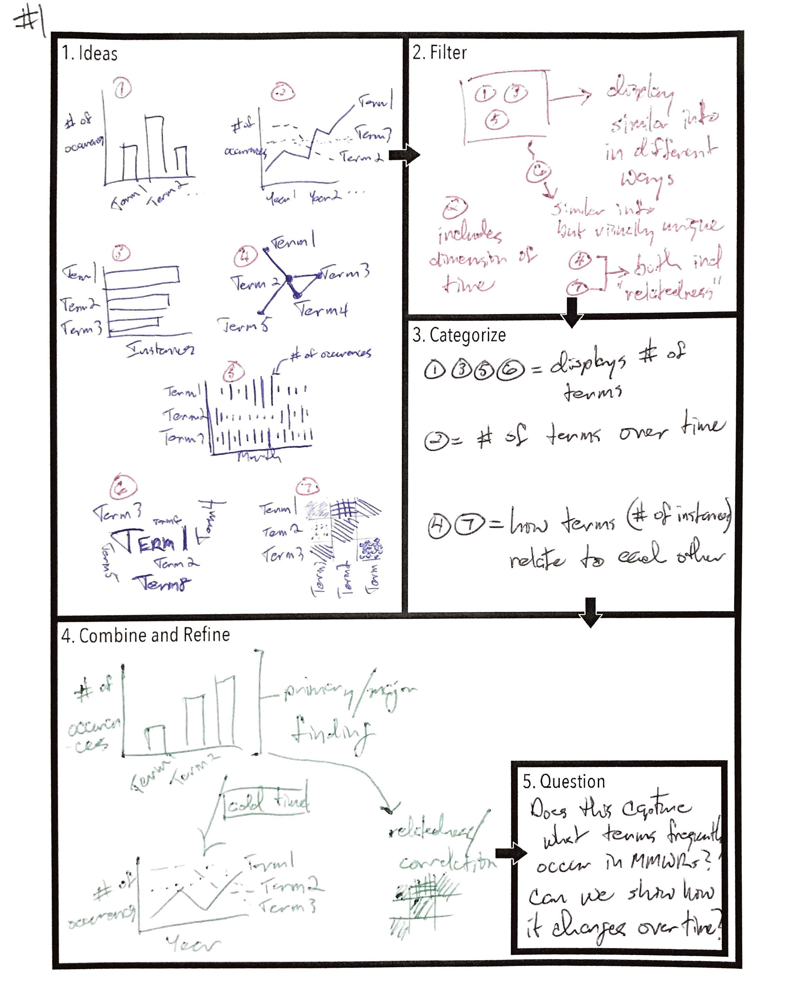
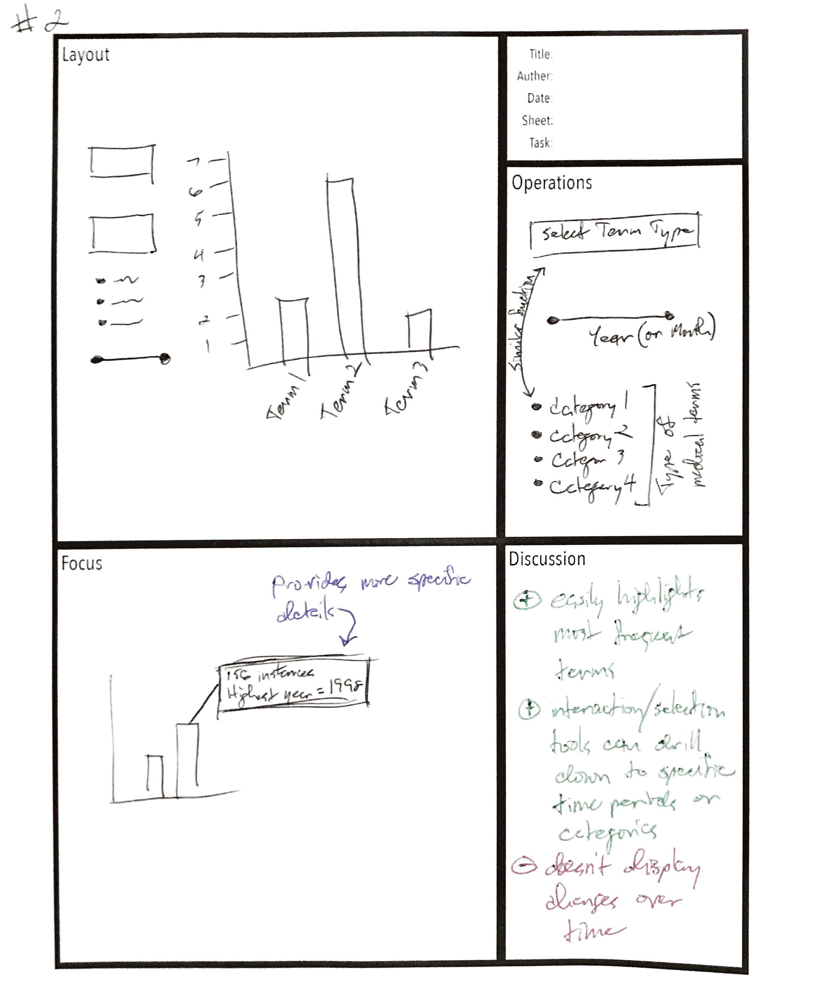
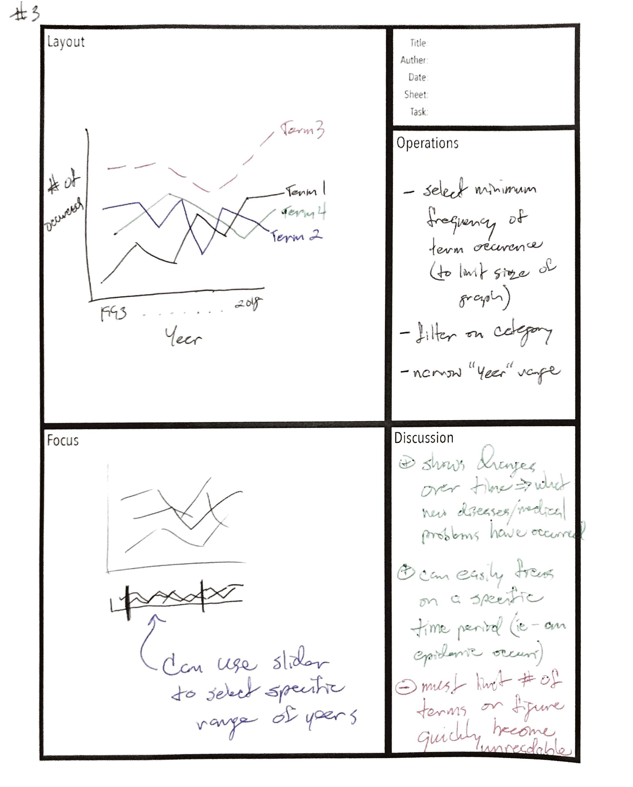
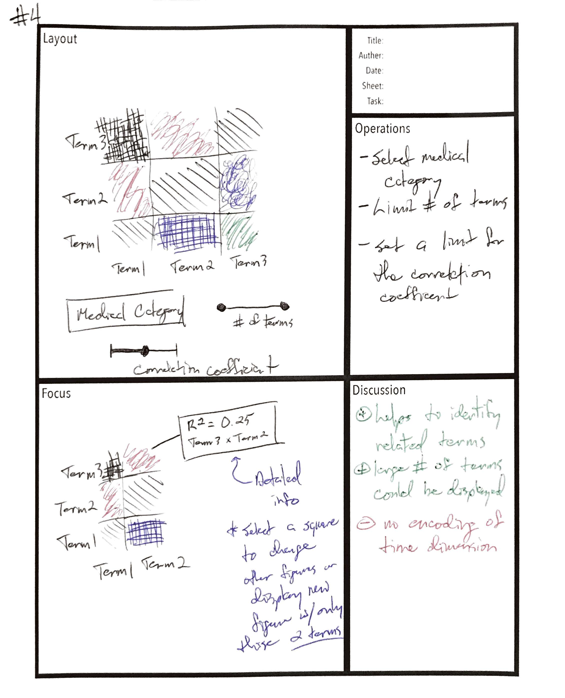
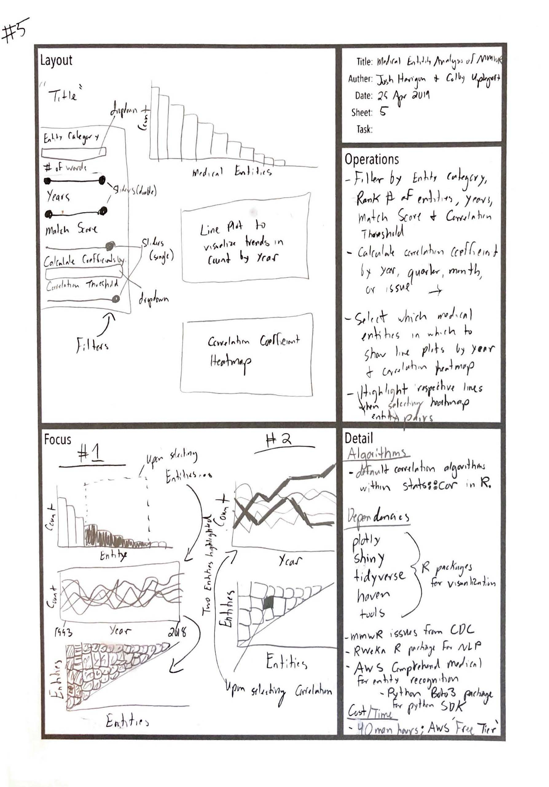

```{r setup, include=FALSE}
knitr::opts_chunk$set(echo = TRUE)
```

```{r, echo=FALSE, message=FALSE, error=FALSE}
#Libraries
library(haven)
library(tidyverse)
library(plotly)
dataset <- as.data.frame(read_dta('mmwr.dta'))
```

# Visualizing Medical Entities in the CDC's Mortality & Morbidity Weekly Reports, 1993 - 2018

## Dataset & Key Statistics

### Description of Mortality & Morbidity Weekly Reports

The Morbidity and Mortality Weekly Report (MMWR) series is published by the Centers for Disease Control and Prevention (CDC), as the name implies, on a weekly basis.  The series is the CDC's primary route for, ".scientific publication of timely, reliable, accurate, objective, and useful public health information and recommendations."  Specifically, the weekly series, the focus of this study, is based on weekly reports to the CDC from state public health departments; thus, each issue represents current trends in notifiable diseases, outbreaks, and conditions of public health concern across the United States.[1] It currently has a SCImago Journal Rank (SJR) score of 9.323, ranked 88th among 34,171 journals[2] and a journal impact factor of 12.888, ranked second in the subject category 'Public, Environmental & Occupational Health' in the Science Citation Index Expanded edition of Journal Citation Reports.[3]  
Given these frequent, reputable, and impactful publications, MMWR Weekly represents a robust longitudinal source of public health information, but digital editions currently exist in an entirely unstructured format, either in HTML or PDF.  However, with natural language processing (NLP) and machine learning (ML), one could process these publications to gleam public health insights and trends for the United States.

### Dataset 

For each issue published between 1993-2018, with the exclusion of 2015, we identified all single-, bi-, and tri-grams using the `RWeka` package.  Each of these grams was then passed to Amazon Web Services (AWS) Comprehend Medical, an NLP tool specifically trained to recognize medical entities in raw text.  The `RWeka` preprocessing was necessary to stay within AWS's 'Free Tier.' Medical entities returned include anatomy, medications, medical conditions, medications, protected health information, and tests, treatments, & procedures.  However, entity categories of anatomy and medications were excluded.  The resulting dataset includes 106,983 observations with the following columns & attributes:

```{r, echo=FALSE, message=FALSE, error=FALSE}
head(dataset)
```

- id [numeric]: Unique ID assigned to each observation
- year [numeric]: Publication year
- quarter [numeric]: Publication quarter
- month [numeric]: Publication month
- issue [numeric]: Publication issue
- text [character]: Text string of medical entity
- count [numeric]: Number of occurrences of medical entity in that respective issue
- main_score [numeric]: Match score for the medical entity category returned by AWS
- category [character]: Medical entity category
- type [character]: Medical entity category type
- trait [character]: Medical entity trait
- trait_score [numeric]: Medical entity trait score

This dataset would be interesting to visualize for several reasons: 1) It's never been visualized before; 2) Gleaming insight from how such an immense number of medical entities with multiple attributes are mentioned across 26 years likely requires advanced visualization techniques

### Summary Graphs

```{r, echo=FALSE, message=FALSE, error=FALSE}
dataset %>% 
  plot_ly() %>% 
  group_by(category) %>% 
  summarise(total = sum(count)) %>%
  arrange(desc(total)) %>% 
  add_bars(x = ~category, y = ~total) %>%
      layout(xaxis = list(title = paste0('<b>','Medical Entity Category', '</b>'), categoryorder = "array", categoryarray = ~text,
                          ticks = 'outside',
                          tickangle = -30), 
             yaxis = list(title = paste0('<b>','Frequency', '</b>')),
             title = paste0('<b>Frequency of the Medical Entity Categories</b>'))
```

```{r, echo=FALSE, message=FALSE, error=FALSE}
dataset %>% 
  plot_ly() %>% 
  filter(category == 'medication') %>% 
  group_by(text) %>% 
  summarise(total = sum(count)) %>%
  arrange(desc(total)) %>% 
  slice(1:50) %>% 
  add_bars(x = ~text, y = ~total) %>%
      layout(xaxis = list(title = "", categoryorder = "array", categoryarray = ~text,
                          ticks = 'outside',
                          tickangle = -30), 
             yaxis = list(title = paste0('<b>','Frequency', '</b>')),
             title = paste0('<b>Cumulative Frequency of the Top 50 Medications</b>'))
```

```{r, echo=FALSE, message=FALSE, error=FALSE}
dataset %>% 
  plot_ly() %>% 
  filter(category == 'medical_condition') %>% 
  group_by(text) %>% 
  summarise(total = sum(count)) %>%
  arrange(desc(total)) %>% 
  slice(1:50) %>% 
  add_bars(x = ~text, y = ~total) %>%
      layout(xaxis = list(title = "", categoryorder = "array", categoryarray = ~text,
                          ticks = 'outside',
                          tickangle = -30), 
             yaxis = list(title = paste0('<b>','Frequency', '</b>')),
             title = paste0('<b>Cumulative Frequency of the Top 50 Medical Conditions</b>'))
```

```{r, echo=FALSE, message=FALSE, error=FALSE}
dataset %>% 
  plot_ly() %>% 
  filter(category == 'test_treatment_procedure') %>% 
  group_by(text) %>% 
  summarise(total = sum(count)) %>%
  arrange(desc(total)) %>% 
  slice(1:50) %>% 
  add_bars(x = ~text, y = ~total) %>%
      layout(xaxis = list(title = "", categoryorder = "array", categoryarray = ~text,
                          ticks = 'outside',
                          tickangle = -30), 
             yaxis = list(title = paste0('<b>','Frequency', '</b>')),
             title = paste0('<b>Cumulative Frequency of the Top 50 Tests, Treatments, & Procedures</b>'))
```

## Visualization Tasks & Requirements

With the MMWR dataset described above, one can visualize multiple kinds of information.  First, through simple bar charts, like the ones above, one can see overall summary statistics of the top entities mentioned.  These could be further refined and filtered by entity category, type, trait, year, quarter, month, and issue.  One could also filter out entities below certain match scores.  However, while these types of summary graphs might represent good overview visualizations, users will likely want more granularity such as how these entities were mentioned over time and how they correlate with other entities.  Thus, displaying frequencies by year, quarter, month, and/or issue, as well as some type of correlation plot(s), should also be considered.  Potential users likely represent the same target audience as MMWR Weekly readers, medical and public health professionals.  

### Visualization Tasks

1) Overview bar plot(s) of the top entities within each category
2) Detailed line plot(s) displaying how selected entities from the overview plot occur over time
3) Heatmap (or similar) plot displaying the correlations between these selected entities

- Interaction between all plots that allow users to refine their entity selection
- Ability to filter by entity category, type, timeframe, match score, and correlation coefficient threshold

## Five Design Sheet Methodology

### Visualization Challenges

The main challenge with this dataset is visualizing both overview summary statistics, the trends across years, and the correlations among the medical entities.  All require separate types of visualizations.  Additionally, with the sheer number of entities, visualizing all of them simultaneously would not be a pleasant user experience or useful in gleaming insight from the dataset.  To address these challenges, visualizations involving this dataset should involve some type(s) of interaction techniques, likely overview + detail and/or brushing + linking.

### Implementation Plan

To implement our application, we plan to create a Shiny app with three different figures. The first and top-most figure will be a simple histogram with individual terms along the x-axis (ie--fever, immunization, influenza, etc) and frequency of occurrence of those terms on the y-axis. This will be ordered in descending values of the number of occurrences (ie--the most frequently occurring word will appear on the left of the plot). Below this primary figure, we will display a line graph with the year along the x-axis and frequency of occurrence of those terms on the y-axis. Each line will represent a term with color and line style to encode the unique terms. Below this second figure, we plan to have a correlation matrix to display correlation coefficients between the displayed terms. The correlation coefficient will be encoded by color. We plan to use a diverging color scheme for this encoding.
 
Our plan calls for several ways to display the data and interaction mechanisms. In the left side bar panel, we plan to use sliders and other selection mechanisms to filter the data by: year, number of words (total number of terms to be displayed on the primary figure's x-axis), medical entity category (AWS Medical Comprehend parse terms into medications, medical conditions, and tests/treatments/procedures), delineation of time measure to calculate the correlation coefficients (by year, month, quarter, issue), and be able to set a threshold for the correlation coefficients to be displayed. Interaction between the figures will occur at several levels. In order to display which terms are selected from the top primary figure to be displayed in the lower second and third figures, we plan to implement a selection feature directly on the primary figure (ie--you can click and drag to select multiple bars which then this selection filters the second and third figures). The second figure will allow for directly selecting a time period to filter all the data. Finally, selecting a square within the correlation matrix of the third figure will filter the second (middle figure) to display only those two terms.

### Design Sheets

```{r echo=FALSE, message=FALSE, error=FALSE, fig.cap="Sheet 1: Brain Storm", out.width = '100%'}

```
```{r echo=FALSE, message=FALSE, error=FALSE, fig.cap="Sheet 2: Initial Design A", out.width = '100%'}

```
```{r echo=FALSE, message=FALSE, error=FALSE, fig.cap="Sheet 3: Initial Design B", out.width = '100%'}

```
```{r echo=FALSE, message=FALSE, error=FALSE, fig.cap="Sheet 4: Initial Design C", out.width = '100%'}

```
```{r echo=FALSE, message=FALSE, error=FALSE, fig.cap="Sheet 5: Realization Design", out.width = '100%'}

```

# Team Member Contributions
```{text}
Josh completed: 
    - Design sheets 1-4 
    - Implementation Plan 
    - Screenshots of live demo 
    - Future work ideas and sketches 
    - PowerPoint slides for presentation 

Colby completed: 
    - Dataset description & key statistics 
    - Visualization tasks & requirements 
    - Design sheet 5 
    - RShiny app coding 
    - PowerPoint slides for presentation 
```

# Screenshots

```{r echo=FALSE, message=FALSE, error=FALSE, fig.cap="Figure 1: Initial, default view of Shiny app upon first loading. Displays the main plot (a histogram) showing the cumulative frequency of extracted medical entities.", out.width = '100%'}
knitr::include_graphics('Screenshots/1.png')
```

```{r echo=FALSE, message=FALSE, error=FALSE, fig.cap="Figure 2: Detailed view of data selection tools.", out.width = '100%'}
knitr::include_graphics('Screenshots/2.png')
```

```{r echo=FALSE, message=FALSE, error=FALSE, fig.cap="Figure 3: Overview of main plot (top histogram) and two subplots. Selecting a subgroup of the medical entities from the top histogram creates subplots for those selected entities.", out.width = '100%'}
knitr::include_graphics('Screenshots/3.png')
```

```{r echo=FALSE, message=FALSE, error=FALSE, fig.cap="Figure 4: The first subplot is a line plot showing the frequency of the selected entities over the selected time period.", out.width = '100%'}
knitr::include_graphics('Screenshots/4.png')
```

```{r echo=FALSE, message=FALSE, error=FALSE, fig.cap="Figure 5: The second subplot is a correlation matrix displaying how highly correlated two terms for the given set of parameters. (Main histogram is cutoff in this screenshot).", out.width = '100%'}
knitr::include_graphics('Screenshots/5.png')
```
  
```{r echo=FALSE, message=FALSE, error=FALSE, fig.cap="Figure 6: Detailed view showing brushings on each plot.", out.width = '100%'}
knitr::include_graphics('Screenshots/6.png')
```

# Future Work

```{r echo=FALSE, message=FALSE, error=FALSE, fig.cap="Figure 7: Brainstorming design sheet for future directions.", out.width = '100%'}
knitr::include_graphics('Screenshots/Future.png')
```

MMWR reports frequently include location data. This is generally in relation to outbreaks of certain infectoius diseases that pose a particular threat to human health. The included location is typically at the county or state level as this is usually the most granular public reporting of such outbreaks reaches. Understanding where these outbreaks occur across the United States, how they cluster, and how they change over time could potentially be valuable for public health professionals. After briefly undertaking a brainstorming session, we feel such data could most accurately by a proportional symbold map (ie--circles or other shapes scaled to the size of a given value at a specific location). This is more favorable to a chloropleth as indicating a value by coloring a state or county can inappropriately give prominence to over-sized sparsely populated large states like Wyoming or Montana. Therefore, we would propose to have a map of the United States overlayed with circles at the location of an outbreak. The number of cases would be indicated by the size of the cirlce. Color of the cirlces could be used to indicate different types of outbreaks (ie--E coli versus Salmonella infections). A major question (and potential limitation) for this approach is whether or not we could adequate represent temporality to show how an outbreak evolves over time.

# References

1) Centers for Disease Control and Prevention. Morbidity and Mortality Weekly Report (MMWR). 2018; https://www.cdc.gov/mmwr/about.html. Accessed April 15, 2019.
2)	Scimago Lab. Scimago Journal & Country Rank. 2017; https://www.scimagojr.com/journalrank.php?page=1&total_size=34171. Accessed April 15, 2019, 2019.
3)	Clarivate Analytics. 2018 Journal Citation Reports. 2018.
